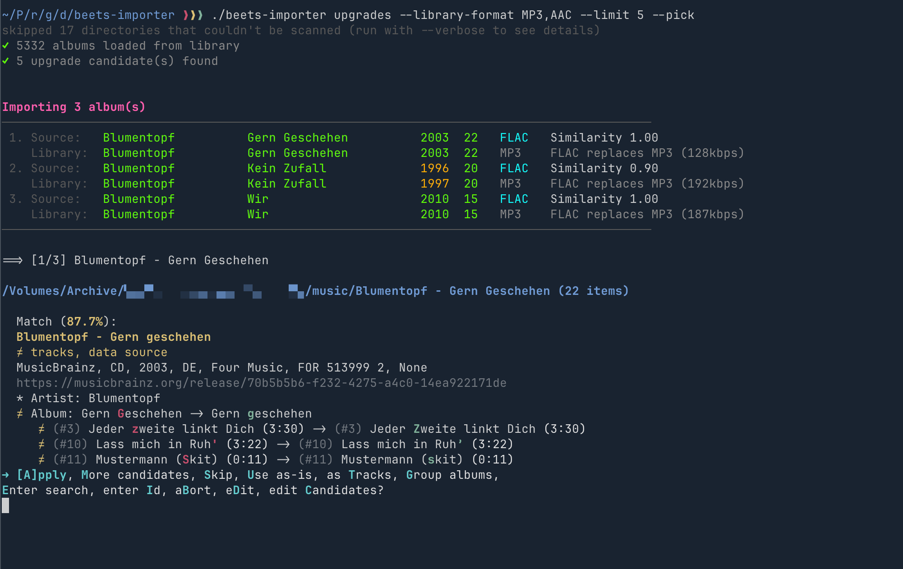
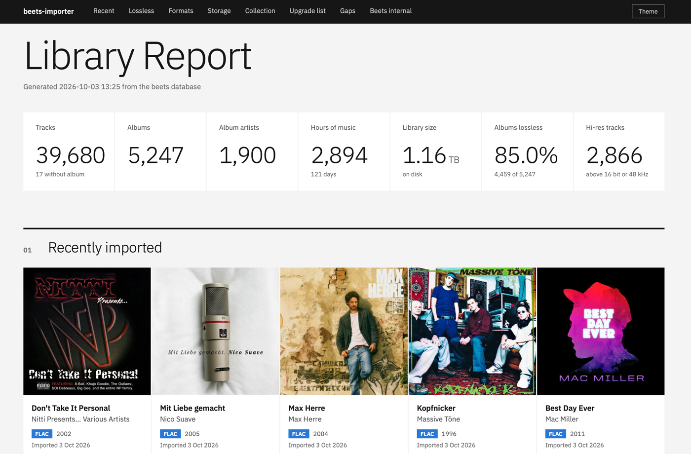
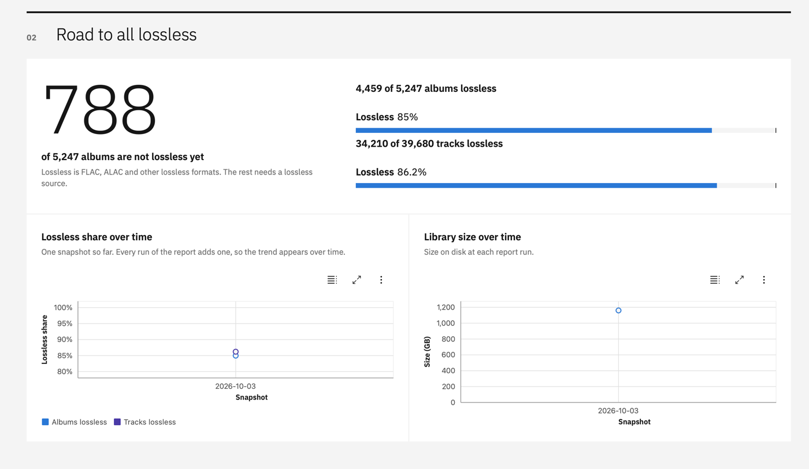
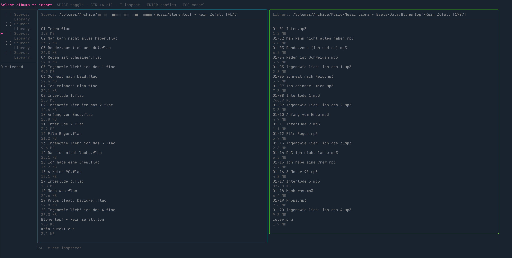
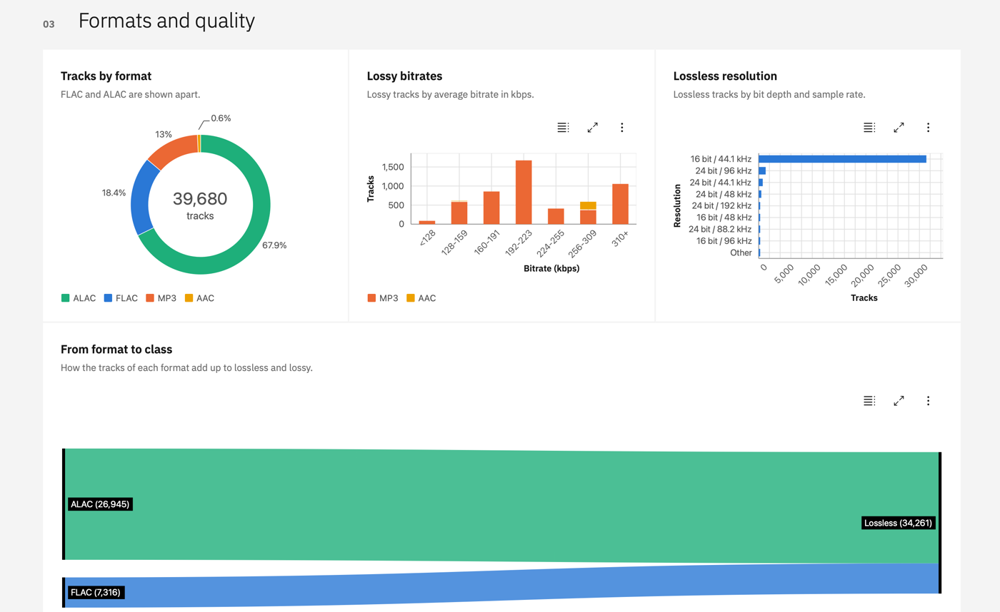
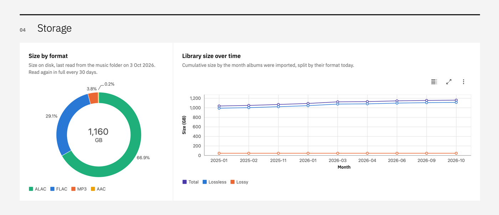
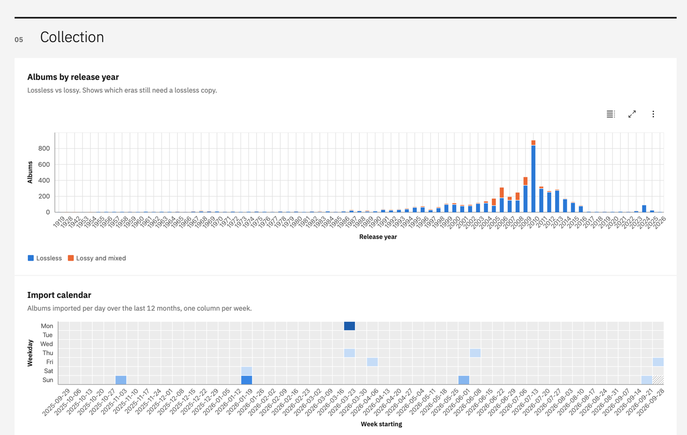
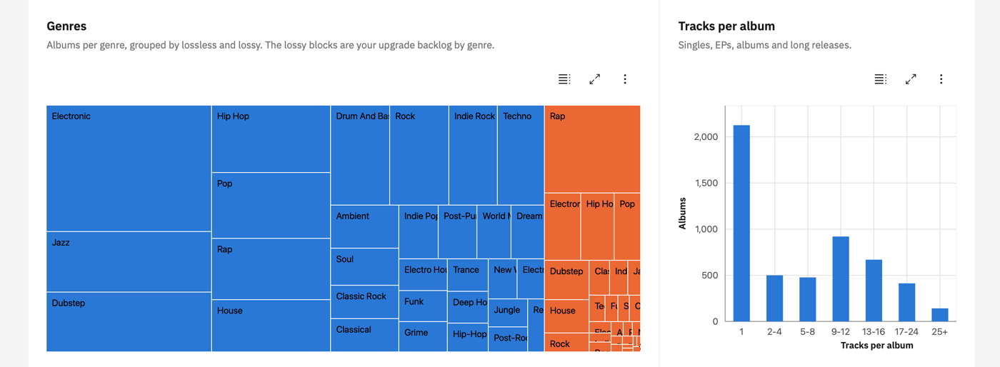
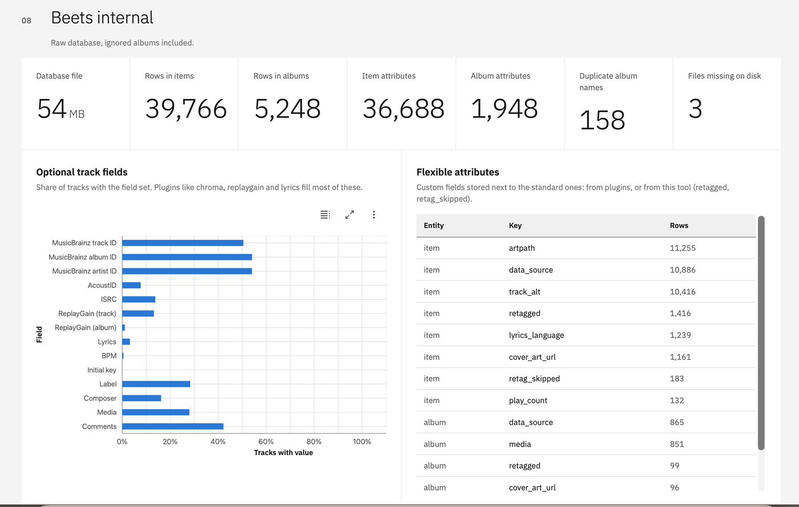

# beets-importer

A command line tool for [beets](https://beets.readthedocs.io). It adds batch import, upgrade finding, library repair and a statistics report on top of `beet`. It only reads your beets database. Every change is made by calling `beet`.

beets imports albums one by one. If your inbox is large, you can not look at everything at once, pick what you want now and skip the rest. `beets-importer` adds a terminal UI in front of `beet import`, so you can select many albums before anything is imported.

`upgrades -i` matches your inbox against your library and shows upgrade candidates next to the library copy:

[](#upgrades-find-upgrade-candidates)

`report` writes a static HTML page about your library. Click the image to watch a short demo:

[](https://img.notmyhostna.me/hwTytMNws1yfx5Z8Hcbv)

[](#report-library-statistics-as-a-web-page)

## Why use it with beets

beets does the tagging. beets-importer adds the tools around it:

1. Import in batches. beets goes through a folder one album at a time. Here you see all new folders, tick the ones you want, and they import as a queue. Folders you skipped do not come back.
2. Find upgrades. `upgrades -i` compares your inbox with your library and shows which albums are better, for example FLAC instead of MP3. You see both copies side by side and import your picks.
3. Track your library over time. `report` writes one HTML page with formats, bitrates, size and gaps. Every run saves a snapshot, so you can see your progress to an all-lossless library.
4. Find problems. `doctor` checks for split albums, artists spelled in different ways, untracked or empty folders, missing years and artwork, and more.
5. Fix them in a queue. `maintenance` turns what `doctor` finds into work. You pick the cases, and the fixes run one by one. Finished albums are marked, so you can stop and continue later.

It reads the beets database and calls `beet` for every change. Your plugins and config stay as they are.

## Features

- Bring in new music
  - `import`: pick albums from your source folder and import them
    - The picker lists new folders, newest first. Folders beets already processed are left out
    - `--since`, `--limit` and `--reimport` make the list shorter or longer
    - `--from-file`: import a list of paths (a text file, or the CSV from `upgrades --csv`)
  - `upgrades`: find albums in the source folder that are better than your library copy
    - Finds format upgrades (MP3 to FLAC) and higher bitrates
    - Filters: `--library-format`, `--source-format`, `--lossy-to-lossless`, `--threshold`, `--min-bitrate-delta`, `--require-year-match`
    - `-i`: pick candidates, compare source and library side by side, ignore wrong matches
    - `--csv`: write the candidates to a file for `import --from-file`
- Fix your library
  - `doctor`: find problems (read-only)
    - Checks for empty and untracked folders, low bitrate, DRM files, missing artwork or year, split albums, different artist spellings and duplicate Unicode names
    - `--json`, `--paths` and `--ids` print results for scripts
  - `maintenance`: pick linters and fix what they find, one by one
  - `import --retag`: retag albums that are already in the library with `beet import -L`
    - `--from-file`: album IDs from a file (`doctor --ids` makes one)
    - `--from-playlist`: album IDs from a Navidrome playlist
- Understand your library
  - `report`: one HTML page with formats, bitrates, years, gaps and your progress towards an all-lossless library
    - Saves a snapshot on every run, so the page can show progress over time
- Setup
  - `config init`: write an example config file
  - `config show`: show the values in use

---

## Requirements

- [beets](https://beets.readthedocs.io), installed and set up
- [ffmpeg](https://ffmpeg.org/download.html) (`ffprobe`): needed by `upgrades` to read bitrates

## Getting started

### 1. Install

**Homebrew (macOS/Linux):**

```sh
brew tap dewey/beets-importer https://github.com/dewey/beets-importer
brew install dewey/beets-importer/beets-importer
```

**Go:**

```sh
go install github.com/dewey/beets-importer@latest
```

**From source:**

```sh
make build
```

### 2. Run

If `beet` is on your `PATH`, you do not need a config file for `report` and `doctor`. beets-importer asks `beet` where your database is.

```sh
# Write an HTML report about your library
beets-importer report

# Check the health of your library
beets-importer doctor
```

`import` and `upgrades` also need to know your source folder, so they need a config file.

### 3. Create a config file (for import and upgrades)

```sh
beets-importer config init
```

This copies [`internal/config/config.example.yaml`](internal/config/config.example.yaml) to `~/.config/beets-importer/config.yaml` and prints the path. Set at least `source`:

```yaml
# Folder with new albums
source: ~/Music/Inbox
```

Then check the result:

```sh
beets-importer config show
```

---

## Configuration

The config file is `~/.config/beets-importer/config.yaml`. Use `--config /path/to/file.yaml` to load another file.

### Defaults taken from beets

If you do not set these, beets-importer finds them:

| Setting | Default |
|---|---|
| `beet` | The first `beet` on your `PATH` |
| `db` | The `library` option of beets (from `beet config`) |
| `state_file` | The `statefile` option of beets (from `beet config`) |
| `data_dir` | A `beets-importer` folder next to the beets database |
| `report_output` | A `report` folder in the data folder |

A value in the config file or on the command line always wins. `source` has no default, because beets does not know it.

### Beet wrapper script

If you run beets with [uv](https://docs.astral.sh/uv/) and a config file in your project, point `beet` at a wrapper script. For example `~/Music/Music Library Beets/beet.sh`:

```bash
#!/bin/bash
DIR="$(dirname "$(realpath "$0")")"
exec uv run --project "$DIR" beet -c "$DIR/plugins/config.yaml" "$@"
```

```yaml
beet: ~/Music/Music Library Beets/beet.sh
```

### Ignoring albums

List album names under `ignore.albums` to hide them everywhere: the import picker, `import --retag`, `upgrades` and the doctor linters that read the beets database. Names are compared without case. `untracked_dirs` still counts their tracks, so their folders are not reported as untracked.

```yaml
ignore:
  albums:
    - "! random !"
```

## Shared flags

Each command only has the flags it uses. Set a flag in the config file or on the command line. The command line wins.

| Flag | Config key | Commands | Description |
|---|---|---|---|
| `--config` | | all | Path to the config file (default: `~/.config/beets-importer/config.yaml`) |
| `--db` | `db` | import, upgrades, doctor, maintenance, report | Path to the beets SQLite database |
| `--source` | `source` | import, upgrades, doctor, maintenance | Folder with new albums |
| `--beet` | `beet` | import, upgrades, doctor, maintenance | Path to the beet binary or a wrapper script |
| `--state-file` | `state_file` | import | Path to the beets incremental state file (`state.pickle`) |
| `--data-dir` | `data_dir` | import, upgrades, report | Folder for the files beets-importer keeps. See [Where files are stored](#where-files-are-stored) |
| `--verbose` | `verbose` | import, upgrades | Print a warning for every folder that could not be scanned, not only a count |
| `--no-cache` | `no_cache` | import, upgrades | Do not use the scan cache and scan everything again |

`beets-importer --version` prints the installed version.

## Where files are stored

| File | Written by | Purpose |
|---|---|---|
| `~/.config/beets-importer/config.yaml` | `config init` | Your settings. Use `--config` to put it elsewhere |
| `<data dir>/ignore.json` | `upgrades -i` | Source and library pairs you ignored |
| `<data dir>/store.db` | `report` | Report snapshots, and the file sizes and cover folders read from disk |
| `<data dir>/scan-cache.json` | `import`, `upgrades` | Scan results of the source folder |
| `<data dir>/report/index.html` | `report` | The report, unless you set `--output` |

The data dir is a `beets-importer` folder next to your beets database. For example, if your database is `~/Music/Library/musiclibrary.db`, the data dir is `~/Music/Library/beets-importer/`. It moves with your library, so you can back both up together. Set `data_dir` in the config or pass `--data-dir` to use another folder.

`ignore.json` and `store.db` are your data. `scan-cache.json` is only a cache. You can delete it at any time and the next run builds it again. Pass `--no-cache` to skip it for one run.

beets-importer never writes to the beets database or the beets config.

---

## `upgrades`: find upgrade candidates

Scans the source folder and compares each album with your beets library. It lists albums where the source copy is better: a better format (for example FLAC replacing MP3), or a clearly higher bitrate in the same format.

Albums are matched by artist and album name, with some tolerance for small differences. Tags in the first audio file are used before the folder name. The score is 35% artist, 55% album name and 10% release year (when both sides have a year). If both years are known and differ by more than 3 years, the albums are not a match.

### Example commands

```sh
# Show a table of all upgrade candidates
beets-importer upgrades

# Stop after 10 candidates (a quick check)
beets-importer upgrades --limit 10

# Only candidates where the library copy is MP3 or AAC
beets-importer upgrades --library-format MP3,AAC

# Only candidates where the source copy is FLAC
beets-importer upgrades --source-format FLAC

# Combine both and open the picker
beets-importer upgrades --library-format MP3,AAC --source-format FLAC -i

# Shortcut for lossy library copies replaced by lossless sources
# (same as --library-format MP3,AAC,OGG,OPUS --source-format FLAC,ALAC,WAV,AIFF,APE)
beets-importer upgrades --lossy-to-lossless -i

# Write the candidates to a CSV file, then import from it later
beets-importer upgrades --csv /tmp/upgrades.csv
beets-importer import --from-file /tmp/upgrades.csv
```

### `--interactive` / `-i`: picker

With `-i`, a picker opens after the scan instead of a table. Each candidate has two rows, so you can compare the source and the library copy:

```
  [ ] Source:   Blumentopf          Kein Zufall             1999  16   FLAC   Similarity 0.90
      Library:  Blumentopf          Kein Zufall             1999  16   MP3    FLAC replaces MP3 (192kbps)
  [ ] Source:   Curren$y            Pilot Talk II           2010  6    FLAC   Similarity 0.86
      Library:  Curren$y            Pilot Talk III          2015  14   MP3    FLAC replaces MP3 (256kbps)
```

Columns: artist, album, year, track count, format. Fields that match are green. Fields that differ (year, track count) are orange.

To hide a wrong match (for example "Square One" matched to "Square Two"), select it and press `x` ("X ignore in upgrades"). The row is unselected and greyed out (`[⊘]`) but stays in the list. To undo it, select the greyed row and press `x` again. Ignored rows are never imported, and `CTRL+A` skips them. They are saved when the picker closes, also on ESC.

Ignores are saved per feature in `ignore.json` in the [data folder](#where-files-are-stored), so an ignore in `upgrades` does not change other commands. Only that exact source and library pair is ignored. Ignored pairs are hidden on later runs and do not count toward `--limit`. To undo an ignore later, run `upgrades -i --show-ignored`. It shows ignored pairs greyed out at the bottom.

Press `I` on a candidate to compare the files of the source and library folders side by side. Use it to check a match before you import:



**Keys:** `SPACE` toggle, `CTRL+A` select all, `j/k` or arrows to move, `ENTER` confirm, `ESC` cancel, `I` inspect

### Flags

| Flag | Default | Description |
|---|---|---|
| `--interactive`, `-i` | false | Open a picker after the scan to select candidates to import |
| `--limit` | 0 | Stop after this many candidates (0 = scan everything) |
| `--threshold` | 0.70 | Lowest score (0 to 1) for a source and library pair to count as a match |
| `--min-bitrate-delta` | 32 | Smallest bitrate gain in kbps that counts as an upgrade in the same format |
| `--library-format` | none | Only look at library albums in these formats, comma-separated (for example `MP3,AAC`) |
| `--source-format` | none | Only look at source albums in these formats, comma-separated (for example `FLAC`) |
| `--lossy-to-lossless` | false | Same as `--library-format MP3,AAC,OGG,OPUS --source-format FLAC,ALAC,WAV,AIFF,APE`. Can not be used with those flags |
| `--show-ignored` | false | With `-i`, also list ignored candidates, greyed out, so you can unignore them |
| `--require-year-match` | false | Skip candidates where both sides have a year and the years differ |
| `--csv` | none | Write the candidates to this CSV file instead of printing a table |
| `--all` | false | Show all matched pairs, not only upgrade candidates |

### Output table columns

| Column | Description |
|---|---|
| Source Directory | Folder name of the source album |
| Library Match | The matching library album (`Artist / Album (Year)`) |
| Score | Similarity from 0 to 1 |
| Year | `✓` if both sides have the same year, `✗` if they differ |
| Format | The format change, for example `MP3→FLAC` |
| Avg Bitrate | The bitrate change, for example `192→870 kbps` |
| Upgrade Reason | For example `FLAC replaces MP3 (192kbps)` or `385kbps replaces 320kbps` |

---

## `import`: import albums

`import` opens a picker by default. Pass `--from-file` to import a list of paths instead.

### Picker (default)

Lists the newest folders in the source folder that are not in your beets library yet. You select what you want, then `beet import` runs for each selection.

```sh
# Pick from everything new in the source folder
beets-importer import

# Only show the 20 newest
beets-importer import --limit 20

# Only show albums added on or after a date
beets-importer import --since 2024-01-01
```

Folders that beets already processed (applied or skipped) are left out. The list comes from the beets state file, so beets must run with `incremental: yes`. Paths are compared exactly. If you run `import --limit 5` twice, the second run shows the next 5 folders. Pass `--reimport` to list processed folders too. It also runs `beet import --noincremental`, because beets would skip them otherwise.

### `--from-file`: import from a file

Runs `beet import` for each path in a file. The format depends on the file extension:

- **`.csv`**: reads the `source_path` column. The CSV from `upgrades --csv` works as is
- **anything else**: one path per line. Empty lines and lines starting with `#` are ignored

```sh
beets-importer import --from-file /tmp/upgrades.csv
beets-importer import --from-file /tmp/my-list.txt --limit 5
```

### `--retag`: retag albums from a list of album IDs

Runs `beet import -L` for each beets album ID in a file, one ID per line. Empty lines and lines starting with `#` are ignored. Use it to fix albums that are already in your library, for example artist names that are spelled in different ways.

```sh
# Retag the next 10 albums from the list
beets-importer import --retag --from-file split-albums.txt --limit 10
```

Albums are retagged in batches of 20, with one `beet import -L` call per batch. beets looks up the next albums while you decide on the current one. The albums of a batch are listed with their IDs before it starts. Every album gets the field `retagged` set to today's date (`beet import --set`). Albums you skip at the beets prompt get `retag_skipped` instead, read from the beets import log. Run the same command again to get the next 10, because albums with either field are left out. When beets applies a match, the album gets a new ID, so IDs that are no longer in the library also count as done. If beets stops before it applied or skipped every album of a batch (after aBort, or after "Merge all" on a duplicate), those albums are not marked and you are asked if you want to go on.

```sh
# What was retagged or skipped
beet ls -a retagged:2026-09-27
beet ls -a retag_skipped::.

# Offer a skipped album again
beet modify -a id:1234 retag_skipped!
```

### `--from-playlist`: retag the albums of a Navidrome playlist

With `--retag`, `--from-playlist` takes the album IDs from a Navidrome playlist instead of a file. Every album with a track in the playlist is retagged once. The playlist ID is the last part of the playlist URL, for example `1LWVZhA0vqU46FAJmzEzWG` in `https://music.example.com/app/#/playlist/1LWVZhA0vqU46FAJmzEzWG/show`.

```sh
beets-importer import --retag --from-playlist 1LWVZhA0vqU46FAJmzEzWG --limit 10
```

Tracks are matched by file path, so the music folder of Navidrome must be the same as `directory:` in beets. Tracks that beets does not know are listed. This happens when beets moved files and Navidrome did not scan again, or when a folder is not in beets at all (see `doctor --linter untracked_dirs`). It needs the `navidrome` section in the config:

```yaml
navidrome:
  url: https://music.example.com
  username: me
  password_command: op read op://Private/Navidrome/password
```

### Flags

| Flag | Default | Description |
|---|---|---|
| `--from-file` | none | Import the paths in this file instead of opening the picker |
| `--retag` | false | Retag library albums with `beet import -L`. Album IDs come from `--from-file` or `--from-playlist` |
| `--from-playlist` | none | With `--retag`, retag the albums of this Navidrome playlist ID |
| `--limit` | 0 | Most albums to process (0 = no limit) |
| `--since` | none | Only show albums added on or after this date (YYYY-MM-DD). Not with `--from-file` |
| `--reimport` | false | Also list folders beets already processed, and import them again with `--noincremental` |

---

## `maintenance`: fix what the linters find

Runs the doctor linters, shows how many cases each one found, and lets you fix them one by one:

1. Pick linters with SPACE and press ENTER.
2. For each linter, pick the cases to fix. CTRL+A selects all, I shows the folder.
3. The fixes run one by one, like the import queue. The run stops at the first error. Retags that follow each other run in batches of 20, like `import --retag`.

```sh
beets-importer maintenance
beets-importer maintenance --folders --limit 20
```

| Linter | Fix |
|---|---|
| `split_albums`, `artist_variants`, `missing_year`, `lowercase_metadata` | Retag the album with `beet import -L`, like `import --retag`. Albums marked `retagged` or `retag_skipped` are hidden |
| `split_imports` | Shows the albums of the group and asks. On yes, it merges them into one album (`beet modify album_id=…`, then removes the empty album rows) and retags it. After a skip, the files are still moved together with `beet move` |
| `missing_artwork` | `beet fetchart` for the album |
| `untracked_dirs` | `beet import -m --noincremental` on the folder, which moves it into place |
| `empty_dirs` | Remove the folder |
| `protected_audio` | Delete the file with `beet remove -d`. The album goes away with its last track. Before a queue with deletions starts, you are asked once to confirm |
| `low_quality`, `duplicate_names` | Report only. Use `upgrades`, or fix it on the file server |

Track linters are grouped by album. An album with ten lowercase tracks is retagged once. An album found by two linters is also fixed once. Nothing is saved between runs, because fixed cases are gone from the next run.

| Flag | Default | Description |
|---|---|---|
| `--folders` | false | Also run the linters that walk the library folder (`empty_dirs`, `untracked_dirs`, `duplicate_names`). They can take minutes on a network share |
| `--limit` | 0 | Most fixes to run (0 = no limit) |

---

## `doctor`: check library health

Runs linters against your beets library and shows the results in a view you can scroll.

`doctor` reads the beets database. Some linters also walk the folder that beets moves music into. That folder comes from `directory:` in your beets config (read with `beet config`), so you do not need to set it.

| Linter | Needs library folder | What it finds |
|---|---|---|
| `empty_dirs` | yes | Folders with no entries at all |
| `untracked_dirs` | yes | Folders with audio files but no track in the beets database |
| `low_quality` | no | Tracks below `doctor.low_quality_threshold_kbps` (default 128), and AAC below 256 kbps |
| `lowercase_metadata` | no | Tracks where artist, album and title are all lowercase |
| `protected_audio` | no | Tracks with iTunes FairPlay DRM (`.m4p`). Only iTunes can play them |
| `missing_artwork` | no | Albums without an art path |
| `missing_year` | no | Albums without a year |
| `split_imports` | no | Albums that beets split into several albums on import. This is albums with the same name in one folder (for example split by featured artist, unless two tracks have the same title, which means two copies), and one-track albums with the same album artist and name in different folders (a compilation imported track by track) |
| `split_albums` | no | Albums whose tracks do not agree on album artist, album name or MusicBrainz album ID, or do not agree with the album itself. Navidrome and other players show these twice |
| `artist_variants` | no | Albums whose album artist is written in different ways elsewhere ("Lady GaGa" and "Lady Gaga"), or has the same name with a missing or different artist ID. The spelling used on albums with a MusicBrainz artist ID is taken as correct. "Various Artists" is skipped |
| `duplicate_names` | yes | Folders with two entries that have the same name in different Unicode forms (NFC and NFD). Also checks `--source` |

All linters run by default. Turn one off in the config:

```yaml
doctor:
  linters:
    lowercase_metadata: false
```

### Example commands

```sh
# Interactive report
beets-importer doctor

# Full report as JSON
beets-importer doctor --json

# Only some linters
beets-importer doctor --linter empty_dirs,untracked_dirs

# Paths for one linter, for example to remove empty folders
beets-importer doctor --linter empty_dirs --paths --print0 | xargs -0 rmdir

# Album IDs for one linter, then retag them 10 at a time
beets-importer doctor --linter split_albums --ids > split-albums.txt
beets-importer import --retag --from-file split-albums.txt --limit 10
```

### Duplicate Unicode names

A name like "gehört" can be stored with "ö" as one code point (NFC) or as "o" plus a combining mark (NFD). macOS used to write NFD. Linux tools such as torrent clients write NFC. If a Linux tool writes a file next to an NFD copy from a Mac, the folder has both. Over SMB, macOS lists both entries but can only open one of them, so beets reports extra "unmatched tracks".

`duplicate_names` finds these folders. You must fix them on the file server, where the two names really are different. The Mac can not tell which copy it deletes.

### Flags

| Flag | Default | Description |
|---|---|---|
| `--json` | false | Print results as JSON instead of the interactive view |
| `--linter` | none | Run only these linters, comma-separated |
| `--paths` | false | Print only the issue paths of the selected linters, one per line (needs `--linter`) |
| `--ids` | false | Print only the beets album IDs of the selected linters, one per line, for `import --retag` (needs `--linter`, not for folder linters) |
| `--print0`, `-0` | false | With `--paths`, separate paths with NUL (for `xargs -0`) |

---

## `report`: library statistics as a web page

[Watch the demo video](https://img.notmyhostna.me/hwTytMNws1yfx5Z8Hcbv)

Reads the beets database (read-only) and writes one `index.html`. You do not need a server. The page loads [Carbon Charts](https://charts.carbondesignsystem.com) and the IBM Plex font from jsDelivr (fixed versions, with integrity hashes where it matters), so your browser needs internet access. Covers of recent imports are linked from the file system at full size. A smaller copy is embedded in case the file can not be opened.

```sh
# Writes <data dir>/report/index.html
beets-importer report

# Write it somewhere else
beets-importer report --output ~/Music/report
```

### More screenshots

Formats, lossy bitrates, lossless resolution and how formats add up to lossless and lossy.



Size on disk by format, and library growth by import month.



Albums by release year (lossless and lossy) and the import calendar.



Albums per genre, grouped by lossless and lossy. The lossy blocks are your upgrade backlog by genre, next to the tracks per album.



What is in the beets database, including the fields your plugins fill.



The page shows:

- **Recently imported**: the last 10 albums with cover art, format and import date
- **Road to all lossless**: albums and tracks split into lossless (FLAC, ALAC and others), lossy and mixed
- **Formats and quality**: tracks per format (FLAC and ALAC apart), lossy bitrates, lossless bit depth and sample rate, and a flow from format to class
- **Storage**: size on disk by format, and library size per import month
- **Collection**: albums per release year, an import calendar, top artists, albums per month, genres, tracks per album, album types and labels
- **Upgrade list**: the artists with the most lossy albums
- **Gaps**: how complete the metadata is, and a list you can filter for each gap (lossy and mixed albums, duplicate albums, files missing on disk, no album name, no year, no cover art, cover in folder only, no genre, no MusicBrainz or Discogs ID, tracks without title or number, singletons). Lists show the first 500 rows. Counts are exact
- **Beets internal**: database file size, row counts, which optional track fields plugins filled (MusicBrainz IDs, ReplayGain, lyrics and more), the flexible attributes in use and duplicate album names. This part reads the raw database, so ignored albums are included

Every list of albums has a **Copy** button that puts `Artist - Album` on the clipboard, and a link to the MusicBrainz or Discogs release when beets knows its ID. The lists also have buttons to copy all rows, with or without links. Use them to search for lossless copies.

Details:

- An album has cover art when beets has an art path, or when its folder has `cover`, `folder`, `front`, `album`, `albumart`, `art` or `artwork` as `.jpg`, `.jpeg`, `.png` or `.webp`. Art inside the audio files is not detected.
- File sizes and cover folders are read from the music folder, which is slow on a network share. They are cached in `store.db` and read again in full every 30 days. Files that are new since the last scan are read on the next run. Pass `--refresh-disk` to read everything again. If more than half of the files are missing, the run stops and saves nothing, because the music folder is probably not mounted.
- Albums in `ignore.albums` are left out. Years before 1900 count as missing. "Various Artists" is left out of the top artists and the upgrade list.

Every run saves a snapshot to `store.db` in the [data folder](#where-files-are-stored). It has the lossless and lossy album counts, the lossless track count and the size on disk. There is one snapshot per day, and the last run of a day wins. The report draws the lossless share of albums and tracks, and the library size, over time from the snapshots. Pass `--no-snapshot` to make a report without saving a snapshot.

| Flag | Config key | Description |
|---|---|---|
| `--db` | `db` | Path to the beets SQLite database |
| `--data-dir` | `data_dir` | Folder for `store.db` and the default report folder |
| `--output` | `report_output` | Folder to write `index.html` to (default: `report` in the data folder) |
| `--no-snapshot` | | Do not save a snapshot of this run |
| `--refresh-disk` | | Read all file sizes and cover images from disk again |
